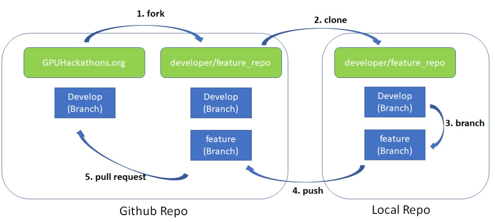

Contributing
------------

Please use the following guidelines when contributing to this project. 

Before contributing significant changes, please begin a discussion of the desired changes via a GitHub Issue to prevent doing unnecessary or overlapping work.

## License

The preferred license for source code contributed to this project is the Apache License 2.0 (https://www.apache.org/licenses/LICENSE-2.0) and for documentation, including Jupyter notebooks and text documentation, is the Creative Commons Attribution 4.0 International (CC BY 4.0) (https://creativecommons.org/licenses/by/4.0/). Contributions under other, compatible licenses will be considered on a case-by-case basis.

## Styling

Please use the following style guidelines when making contributions.

### Source Code
* Two-space indentation, no tabs
* To the extent possible, variable names should be descriptive
* Code should be documentation with detail like what function does and returns making the code readable. The code should also have proper license at the beginning of the file.
* Fortran codes should use free-form source files
* Fortran codes should not use implicit variable names and should use implicit none
* The following file extensions should be used appropriately
	* C - .c
	* C++ - .cpp
	* CUDA C/C++ - .cu
	* CUDA Fortran - .cuf
	* Fortran - .F90

### Jupyter Notebooks & Markdown
* When they appear inline with the text; directive names, clauses, function or subroutine names, variable names, file names, commands and command-line arguments should appear between two backticks.
* Code blocks should begin with three backticks and either 'cpp' or 'fortran' to enable appropriate source formatting and end with three backticks.
* Leave an empty line before and after the codeblock.
Emphasis, including quotes made for emphasis and introduction of new terms should be highlighted between a single pair of asterisks
* A level 1 heading should appear at the top of the notebook as the title of the notebook.
* A horizontal rule should appear between sections that begin with a level 2 heading.

Please refer to the following template for jupyter notebook styling in the [github](https://github.com/openhackathons-org/gpubootcamp/tree/master/misc).

## Contributing Labs/Modules

### Directory stucture for Github

Before starting to work on new lab it is important to follow the recommended git structure as shown below to avoid and reformatting:

```
├── labs/CFD
│   ├── LICENSE
│   └── English
│       ├── C
│           ├── images
│           ├── jupyter_notebook
│               ├── advanced_concepts
│               	├── x.ipynb
│               	└── ...
│               ├── cuda
│               ├── mpi
│               ├── nccl
│               ├── nvshmem
│               └── single_gpu
│           └── source_code
│               ├── cuda
│               	├── solutions
│               	├── x.cu
│               	└── ...
│               ├── mpi
│               ├── nccl
│               ├── nvshmem
│               ├── p2pBandwidthLatencyTest
│               └── single_gpu
│       ├── Presentations
│       └── start_here.ipynb  
├── slurm_pmi_config
├── README.md
└── Singularity
```

Each lab will have following files/directories consisting of training material for the lab.
* `jupyter_notebook` folder: Consists of jupyter notebooks for a specific programming language.  
* `source_code` folder: Source codes are stored in a separate directory for a specific programming language (C/C++ and Fortran). Source code folder may optionally contain Makefile especially for HPC labs. This folder may also contains `SOLUTIONS` folder for all the related solutions to that particular lab.  
* presentations: Consists of presentations for the labs ( pdf format is preferred )
* Dockerfile and Singularity: Each lab should have both Docker and Singularity recipes.
 
The lab optionally may also add custom license in case of any deviation from the top level directory license ( Apache 2.0 ). 

### Git Branching

Adding a new feature/lab will follow a forking workflow. Which means a feature branch development will happen on a forked repo which later gets merged into our original project (GPUHackathons.org) repository.




The 5 main steps depicted in image above are as follows:
1. Fork: To create a new lab/feature the GPUHackathons.org repository must be forked. Fork will create a snapshot of GPUHackathons.org repository at the time it was forked. Any new feature/lab that will be developed should be based on the develop branch of the repository.
2.  Clone: Developer can than clone this new repository to local machine
Create Feature Branch: Create a new branch with a feature name in which your changes will be done. Recommend naming convention of feature branch is naming convention for branch: multigpu-<feature_name>. The new changes that developer makes can be added, committed and pushed
3. Push: After the changes are committed, the developer pushes the changes to the remote branch. Push command helps the local changes to github repository
4. Pull: Submit a pull request. Upon receiving pull request a Hackathon team reviewer/owner will review the changes and upon accepting it can be merged into the develop branch of GpuHacakthons.org

Git Branch details are as follows:

* master branch: Consists of the stable branch. 
	* origin/master to be the main branch where the source code of HEAD always reflects a production-ready state
	* Merge request is possible through:  develop branch
* develop branch: branched from master branch
	* Must branch from: master branch
	* Must merge back into: master branch
	* It is the main development branch where the source code of HEAD always reflects a state with the latest delivered development changes for the next release.
	* When the source code in the develop branch reaches a stable point and is ready to be released, all of the changes should be merged back into master somehow and then tagged with a release number
	* All feature development should happen by forking GPUHackathons.org and branching from develop branch only.
